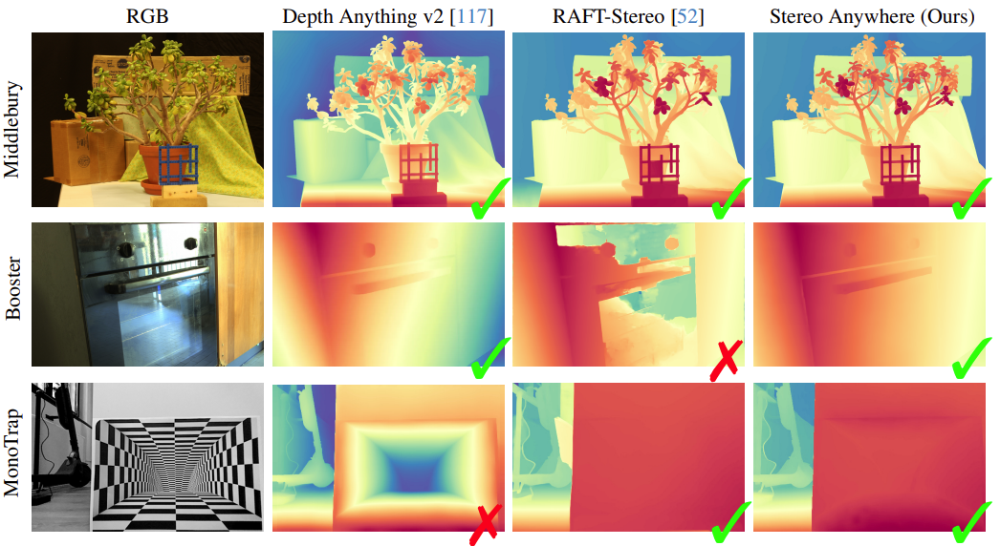
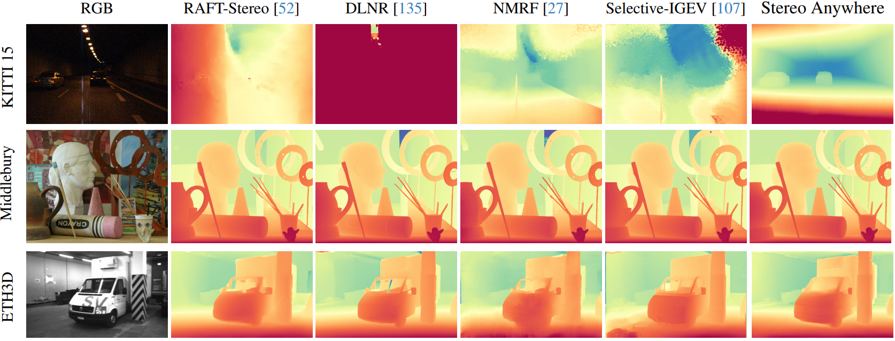
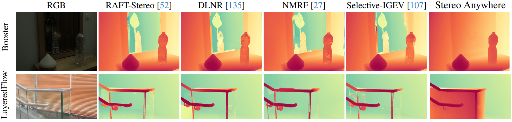
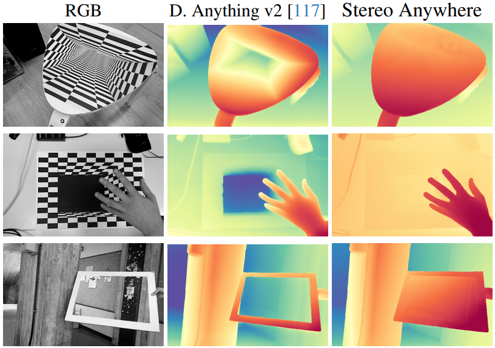

<h1 align="center" style="border-bottom: 0;"> Stereo Anywhere: Robust Zero-Shot Deep Stereo Matching Even Where Either Stereo or Mono Fail (CVPR 2025)</h1> 

<h3 align="center"> <b> Friday, June 13 from 10:30 to 12:30 - Poster Session 1 and Exhibit Hall (ExHall D) </b> </h3>

<!-- <h3 align="center"> Evaluation code released - MonoTrap released - training code coming soon </h3> -->

<hr>

<h1 align="center" style="border-bottom: 0;"> Robust Zero-Shot Depth Perception through Mono-Stereo Fusion (CVPR DEMO 2025) </h1>

<h3 align="center"> <b> Saturday, June 14 from 17:00 to 19:00 - Demos (Hall D) </b> </h3>

<hr>

:rotating_light: This repository will contain download links to our code, and trained deep stereo models of our work  "**Stereo Anywhere: Robust Zero-Shot Deep Stereo Matching Even Where Either Stereo or Mono Fail**",  [CVPR 2025](http://arxiv.org/abs/2412.04472)
 
by [Luca Bartolomei](https://bartn8.github.io/)<sup>1,2</sup>, [Fabio Tosi](https://fabiotosi92.github.io/)<sup>2</sup>, [Matteo Poggi](https://mattpoggi.github.io/)<sup>1,2</sup>, and [Stefano Mattoccia](https://stefanomattoccia.github.io/)<sup>1,2</sup>

Advanced Research Center on Electronic System (ARCES)<sup>1</sup>
University of Bologna<sup>2</sup>

<div class="alert alert-info">

<h2 align="center"> 

 Stereo Anywhere: Robust Zero-Shot Deep Stereo Matching Even Where Either Stereo or Mono Fail (CVPR 2025)<br>

 [Project Page](https://stereoanywhere.github.io/) | [Paper](http://arxiv.org/abs/2412.04472) 
</h2>


<p style="text-align: justify;"><strong>Stereo Anywhere: Combining Monocular and Stereo Strenghts for Robust Depth Estimation.</strong> Our model achieves accurate results on standard conditions (on Middlebury), while effectively handling non-Lambertian surfaces where stereo networks fail (on Booster) and perspective illusions that deceive monocular depth foundation models (on MonoTrap, our novel dataset).</p>

**Note**: 🚧 Kindly note that this repository is currently in the development phase. We are actively working to add and refine features and documentation. We apologize for any inconvenience caused by incomplete or missing elements and appreciate your patience as we work towards completion.

## :bookmark_tabs: Table of Contents

- [:bookmark\_tabs: Table of Contents](#bookmark_tabs-table-of-contents)
- [:clapper: Introduction](#clapper-introduction)
- [:inbox\_tray: Pretrained Models](#inbox_tray-pretrained-models)
- [:memo: Code](#memo-code)
- [:floppy_disk: Datasets](#floppy_disk-datasets)
- [:train2: Training](#train2-training)
- [:rocket: Test](#rocket-test)
- [:video_camera: Practical Demo](#video_camera-practical-demo)
- [:art: Qualitative Results](#art-qualitative-results)
- [:envelope: Contacts](#envelope-contacts)
- [:pray: Acknowledgements](#pray-acknowledgements)

</div>

## :clapper: Introduction

We introduce Stereo Anywhere, a novel stereo-matching framework that combines geometric constraints with robust priors from monocular depth Vision Foundation Models (VFMs). By elegantly coupling these complementary worlds through a dual-branch architecture, we seamlessly integrate stereo matching with learned contextual cues. Following this design, our framework introduces novel cost volume fusion mechanisms that effectively handle critical challenges such as textureless regions, occlusions, and non-Lambertian surfaces. Through our novel optical illusion dataset, MonoTrap, and extensive evaluation across multiple benchmarks, we demonstrate that our synthetic-only trained model achieves state-of-the-art results in zero-shot generalization, significantly outperforming existing solutions while showing remarkable robustness to challenging cases such as mirrors and transparencies.

**Contributions:** 

* A novel deep stereo architecture leveraging monocular depth VFMs to achieve strong generalization capabilities and robustness to challenging conditions.

* Novel data augmentation strategies designed to enhance the robustness of our model to textureless regions and non-Lambertian surfaces.

* A challenging dataset with optical illusion, which is particularly challenging for monocular depth with VFMs.

* Extensive experiments showing Stereo Anywhere's superior generalization and robustness to conditions critical for either stereo or monocular approaches.


:fountain_pen: If you find this code useful in your research, please cite:

```bibtex
@InProceedings{Bartolomei_2025_CVPR,
    author    = {Bartolomei, Luca and Tosi, Fabio and Poggi, Matteo and Mattoccia, Stefano},
    title     = {Stereo Anywhere: Robust Zero-Shot Deep Stereo Matching Even Where Either Stereo or Mono Fail},
    booktitle = {Proceedings of the Computer Vision and Pattern Recognition Conference (CVPR)},
    month     = {June},
    year      = {2025},
    pages     = {1013-1027}
}
```

## :inbox_tray: Pretrained Models

Here, you will be able to download the weights of our proposal trained on [Sceneflow](https://lmb.informatik.uni-freiburg.de/resources/datasets/SceneFlowDatasets.en.html).

You can download our pretrained models [here](https://drive.google.com/drive/folders/1uQqNJo2iWoPtXlSsv2koAt2OPYHpuh1x?usp=sharing).

## :memo: Code

The **Training** section provides a script to train our model using Sceneflow dataset, while our **Test** section contains scripts to evaluate disparity estimation on datasets like **KITTI**, **Middlebury**, **ETH3D**.

Please refer to each section for detailed instructions on setup and execution.

<div class="alert alert-info">

**Warning**:

- With the latest updates in PyTorch, slight variations in the quantitative results compared to the numbers reported in the paper may occur.

</div>

### :hammer_and_wrench: Setup Instructions

1. **Dependencies**: Ensure that you have installed all the necessary dependencies. The list of dependencies can be found in the `./requirements.txt` file.
2. **Set scripts variables**: Each script needs the path to the virtual environment (if any) and to the dataset. Please set those variables before running the script.


## :floppy_disk: Datasets

We used [Sceneflow](https://lmb.informatik.uni-freiburg.de/resources/datasets/SceneFlowDatasets.en.html) dataset for training and eight datasets for evaluation.

Specifically, we evaluate our proposal and competitors using:
- 5 indoor/outdoor datasets: [Middlebury 2014](https://vision.middlebury.edu/stereo/data/scenes2014/), [Middlebury 2021](https://vision.middlebury.edu/stereo/data/scenes2021/), [ETH3D](https://www.eth3d.net/datasets), [KITTI 2012](https://www.cvlibs.net/datasets/kitti/eval_stereo_flow.php?benchmark=stereo), [KITTI 2015](https://www.cvlibs.net/datasets/kitti/eval_scene_flow.php?benchmark=stereo);
- two datasets **containing non-Lambertian** surfaces: [Booster](https://cvlab-unibo.github.io/booster-web/) and [LayeredFlow](https://layeredflow.cs.princeton.edu/);
- and finally with **MonoTrap** our novel stereo dataset specifically designed to challenge monocular depth estimation.

### Sceneflow - FlyingThings (subset)

Download [Images](https://lmb.informatik.uni-freiburg.de/data/FlyingThings3D_subset/FlyingThings3D_subset_image_clean.tar.bz2.torrent) and [Disparities](https://lmb.informatik.uni-freiburg.de/data/FlyingThings3D_subset/FlyingThings3D_subset_disparity.tar.bz2.torrent) from the [official website](https://lmb.informatik.uni-freiburg.de/resources/datasets/SceneFlowDatasets.en.html).

Unzip the archives, then you will get a data structure as follows:

```
FlyingThings3D_subset
├── val
└── train
    ├── disparity
    │   ├── left
    │   └── right
    └── image_clean
        ├── left
        └── right
```

### Sceneflow - Monkaa

Download [Images](https://lmb.informatik.uni-freiburg.de/data/SceneFlowDatasets_CVPR16/Release_april16/data/Monkaa/raw_data/monkaa__frames_cleanpass.tar) and [Disparities](https://lmb.informatik.uni-freiburg.de/data/SceneFlowDatasets_CVPR16/Release_april16/data/Monkaa/derived_data/monkaa__disparity.tar.bz2) from the [official website](https://lmb.informatik.uni-freiburg.de/resources/datasets/SceneFlowDatasets.en.html).

Unzip the archives, then you will get a data structure as follows:

```
Monkaa
├── disparity
└── frames_cleanpass
```

### Sceneflow - Driving

Download [Images](https://lmb.informatik.uni-freiburg.de/data/SceneFlowDatasets_CVPR16/Release_april16/data/Driving/raw_data/driving__frames_cleanpass.tar.torrent) and [Disparities](https://lmb.informatik.uni-freiburg.de/data/SceneFlowDatasets_CVPR16/Release_april16/data/Driving/derived_data/driving__disparity.tar.bz2.torrent) from the [official website](https://lmb.informatik.uni-freiburg.de/resources/datasets/SceneFlowDatasets.en.html).

Unzip the archives, then you will get a data structure similar to the data structure of Monkaa.

### Middlebury 2014 - MiddEval3 (Half resolution)

Download [Images](https://vision.middlebury.edu/stereo/submit3/zip/MiddEval3-data-H.zip), [Left GT](https://vision.middlebury.edu/stereo/submit3/zip/MiddEval3-GT0-H.zip), [Right GT](https://vision.middlebury.edu/stereo/submit3/zip/MiddEval3-GT1-H.zip) from [Middlebury Website](https://vision.middlebury.edu/stereo/submit3/), then unzip the packages.

After that, you will get a data structure as follows:

```
MiddEval3
├── trainingH
│   ├── Adirondack
│   │   ├── im0.png
│   │   ├── im1.png
│   │   ├── mask0nocc.png
│   │   └── disp0GT.pfm
│   ├── ...
│   └── Vintage
└── testH
```

### Middlebury 2021

Download the [Middlebury 2021 Archive](https://vision.middlebury.edu/stereo/data/scenes2021/zip/all.zip) from [Middlebury Website](https://vision.middlebury.edu/stereo/data/scenes2021/). Then download our [occlusion masks](https://drive.google.com/drive/folders/1uQqNJo2iWoPtXlSsv2koAt2OPYHpuh1x?usp=sharing) obtained using LRC. After that, unzip all archives.

Now create symbolic links to recreate the structure of MiddEval3 dataset:

```bash

cd MIDDLEBURY2021_PATH

# for each sequence -- i.e., artroom1, artroom2, ...., traproom2
for i in *
do
    cd $i
    ln -s disp0.pfm disp0GT.pfm
    ln -s disp1.pfm disp1GT.pfm
    cd ..
done
```

You will get a data structure similar to MiddEval3.

### ETH3D

You can download [ETH3D](https://www.eth3d.net/datasets#low-res-two-view-training-data) dataset following this script:

```bash
$ cd PATH_TO_DOWNLOAD
$ wget https://www.eth3d.net/data/two_view_training.7z
$ wget https://www.eth3d.net/data/two_view_training_gt.7z
$ p7zip -d *.7z
```

After that, you will get a data structure as follows:

```
eth3d
├── delivery_area_1l
│    ├── im0.png
│    └── ...
...
└── terrains_2s
     └── ...
```
Note that the script erases 7z files. Further details are available at the [official website](https://www.eth3d.net/datasets).

### KITTI 2012

Go to [official KITTI 2012 website](https://www.cvlibs.net/datasets/kitti/eval_stereo_flow.php?benchmark=stereo), then using a registered account you will be able to download the stereo 2012 dataset.

After that, you need to add some symbolic links:

```bash
cd KITTI2012_PATH
cd training

ln -s colored_0 image_2
ln -s colored_1 image_3
ln -s disp_noc disp_noc_0
ln -s disp_occ disp_occ_0
```

You will get a data structure similar to KITTI 2015.

### KITTI 2015

Go to [official KITTI 2015 website](https://www.cvlibs.net/datasets/kitti/eval_scene_flow.php?benchmark=stereo), then using a registered account you will be able to download the stereo 2015 dataset.

After that, you will get a data structure as follows:

```
kitti2015
└── training
    ├── disp_occ_0
    │    ├── 000000_10.png
    |    ...
    │    └── 000199_10.png
    ├── disp_noc_0
    ├── image_2
    └── image_3
```

### Booster

You can download Booster dataset from [AMSActa](https://amsacta.unibo.it/id/eprint/6876/) (Booster Dataset Labeled - 19GB). Please refer to the [official website](https://cvlab-unibo.github.io/booster-web/) for further details. After that, unzip the archive to your preferred folder.

You will get a data structure as follows:

```
Booster
├── test
└── train
    ├── unbalanced
    └── balanced
         ├── Bathroom
         ...
         └── Washer
```

### LayeredFlow

You can download [LayeredFlow](https://drive.google.com/file/d/1EEFp7AE8ZX75ADztP74Mx7VZ6MOymneN/view) dataset from the [official website](https://layeredflow.cs.princeton.edu/).

Unzip the archive, then you will get a data structure as follows:

```
public_layeredflow_benchmark
├── calib
├── test
└── val
    ├── 0
    ...
    └── 199
```

### MonoTrap

You can download our MonoTrap dataset from our [drive](https://drive.google.com/drive/folders/1uQqNJo2iWoPtXlSsv2koAt2OPYHpuh1x?usp=sharing).

Unzip the archive, then you will get a data structure as follows:

```
MonoTrap
└── validation
    ├── RealTrap
    └── CraftedTrap
```

## :train2: Training

You can use our script `run_train.sh` to train our model using the Sceneflow dataset (please set environment and datasets path correctly).
Before launching the training script, preprocess Sceneflow images with our `mono_sceneflow.py` script:

```bash
python mono_sceneflow.py --datapath <SCENEFLOW_PATH> --monomodel DAv2 --loadmonomodel <MONO_MODEL_PATH>
```

where `SCENEFLOW_PATH` is the path to the folder that contains FlyingThings_subset, Monkaa, Driving, and `MONO_MODEL_PATH` is the path to the pretrained DAv2-Large checkpoint.

## :rocket: Test

To evaluate StereoAnywhere with all datasets except MonoTrap use this snippet:

```bash
python test.py --datapath <DATAPATH> --dataset <DATASET> \ 
--stereomodel stereoanywhere --loadstereomodel <STEREO_MODEL_PATH> \
--monomodel DAv2 --loadmonomodel <MONO_MODEL_PATH> \
--iscale <ISCALE> --oscale <OSCALE> --normalize --iters 32 \
--vol_n_masks 8 --n_additional_hourglass 0 \
--use_aggregate_mono_vol --vol_downsample 0 \
--mirror_conf_th 0.98  --use_truncate_vol --mirror_attenuation 0.9 
```

where `DATAPATH` is the path to the dataset, `DATASET` is the name of the dataset (i.e., `middlebury`, `middlebury2021`, `eth3d`, `kitti2012`, `kitti2015`, `booster`, `layeredflow`), `STEREO_MODEL_PATH` is the path to our pretrained sceneflow checkpoint, `MONO_MODEL_PATH` is the path to the DAv2-Large pretrained monocular model, `ISCALE` is the resolution of input images (use 4 for Booster, 8 for LayeredFlow, 1 for others), `OSCALE` is the resolution of evaluation (use 4 for Booster, 8 for LayeredFlow, 1 for others).

To evaluate StereoAnywhere with our MonoTrap dataset use this snippet:

```bash
python test_monotrap.py --datapath <DATAPATH> \ 
--stereomodel stereoanywhere --loadstereomodel <STEREO_MODEL_PATH> \
--monomodel DAv2 --loadmonomodel <MONO_MODEL_PATH> \
--iscale <ISCALE> --oscale <OSCALE> --normalize --iters 32 \
--vol_n_masks 8 --n_additional_hourglass 0 \
--use_aggregate_mono_vol --vol_downsample 0 \
--mirror_conf_th 0.98  --use_truncate_vol --mirror_attenuation 0.9 
```

## :video_camera: Practical Demo

We will showcase our model with a live demo at CVPR 2025 using an OAK-D Lite stereo camera: we will showcase the performance of our model in challenging non-Lambertian environments, such as those containing mirrors or transparent surfaces.

You can try it using a OAK-D Lite and with the `demo/fast_demo_oak.py` script:

```bash
cd demo
python fast_demo_oak.py \
--stereomodel stereoanywhere --loadstereomodel <STEREO_MODEL_PATH> \ 
--monomodel DAv2RT --loadmonomodel <ENGINE_MODEL_PATH> \ 
--iscale <ISCALE> --iters 32 \ 
--iters 32 --vol_n_masks 8 --volume_channels 8 --n_additional_hourglass 0 \
--use_aggregate_mono_vol --vol_downsample 0 \ 
--mirror_conf_th 0.98  --use_truncate_vol --mirror_attenuation 0.9
```

Before running the script please convert Depth Anything V2 to TensorRT following the official [guide](https://github.com/spacewalk01/depth-anything-tensorrt). 

However,differently from the official repository, we utilized TensorRT 10.8:

- Download CUDA 12 Toolkit from [Nvidia official website](https://developer.nvidia.com/cuda-downloads);
- Download TensorRT 10.8 DEB package from [Nvidia official website](https://developer.nvidia.com/tensorrt/download/10x);
- Download TensorRT 10.8 TAR package from [Nvidia official website](https://developer.nvidia.com/tensorrt/download/10x).

The TAR package is necessary to compile the [converter](https://github.com/spacewalk01/depth-anything-tensorrt) from .onnx model to .engine model.

Then, install additional python requirements using `python -m pip install -r requirements_demo.txt`

If you don't have a OAK-D Lite camera, you can still try the demo using the `demo/fast_demo.py` script:

```bash
cd demo
python fast_demo.py \
--left <LEFT_IMAGE_PATH> --right <RIGHT_IMAGE_PATH> --outdir <OUTPUT_PATH> \ 
--stereomodel stereoanywhere --loadstereomodel <STEREO_MODEL_PATH> \ 
--monomodel DAv2RT --loadmonomodel <ENGINE_MODEL_PATH> \ 
--iscale <ISCALE> --iters 32 \ 
--iters 32 --vol_n_masks 8 --volume_channels 8 --n_additional_hourglass 0 \ 
--use_aggregate_mono_vol --vol_downsample 0 \ 
--mirror_conf_th 0.98  --use_truncate_vol --mirror_attenuation 0.9 \ 
--display_qualitatives --save_qualitatives
```

If you have problems with Out Of Memory exceptions, you can try to adjust the `--vol_downsample` or `--iscale` hyperparameters.

## D435i Realtime Benchmark

`scripts/realtime_d435i.py` matches the live D435i benchmark contract used by
the other model repos in `vis_to_sim_baselines`: `bench` / `apriltag` modes,
the same CSV columns, recorded `ir_left.png`, `ir_right.png`, `disp.npy`,
`depth.npy`, `overlay.png`, and the same end-of-run summary. It uses the
D435i IR stereo pair and converts StereoAnywhere disparity to metric depth
with the factory IR intrinsics and baseline.

Create or activate the dedicated environment:

```bash
conda env create -f environment.yml
conda activate stereoanywhere
```

Place the pretrained checkpoints at:

```text
weights/stereoanywhere_sceneflow.pth
weights/depth_anything_v2_vitl.pth
```

Then run the AprilTag benchmark:

```bash
python scripts/realtime_d435i.py \
  --mode apriltag \
  --tag-size 0.16 \
  --log results/stereoanywhere_apriltag.csv \
  --record-dir results/stereoanywhere_apriltag_frames
```

For latency/FPS only:

```bash
python scripts/realtime_d435i.py \
  --mode bench \
  --log results/stereoanywhere_bench.csv \
  --record-dir results/stereoanywhere_bench_frames
```

## :art: Qualitative Results

In this section, we present illustrative examples that demonstrate the effectiveness of our proposal.

<br>

<p float="left">
  
</p>
 
**Qualitative Results -- Zero-Shot Generalization.** Predictions by state-of-the-art models and Stereo Anywhere. In particular the first row shows an extremely challenging case for SceneFlow-trained models, where Stereo Anywhere achieves accurate disparity maps thanks to VFM priors.
 
<br>

<p float="left">
  
</p>

**Qualitative results -- Zero-Shot non-Lambertian Generalization.** Predictions by state-of-the-art models and Stereo Anywhere. Our proposal is the only stereo model correctly perceiving the mirror and transparent railing.

<br>

<p float="left">
  
</p>

**Qualitative results -- MonoTrap.** The figure shows three samples where Depth Anything v2 fails while Stereo Anywhere does not.

## :envelope: Contacts

For questions, please send an email to luca.bartolomei5@unibo.it

## :pray: Acknowledgements

We would like to extend our sincere appreciation to the authors of the following projects for making their code available, which we have utilized in our work:

- We would like to thank the authors of [RAFT-Stereo](https://github.com/princeton-vl/RAFT-Stereo) for providing their code, which has been inspirational for our stereo matching architecture.
- We would like to thank also the authors of [Depth Anything V2](https://github.com/DepthAnything/Depth-Anything-V2) for providing their incredible monocular depth estimation network that fuels our proposal Stereo Anywhere.
